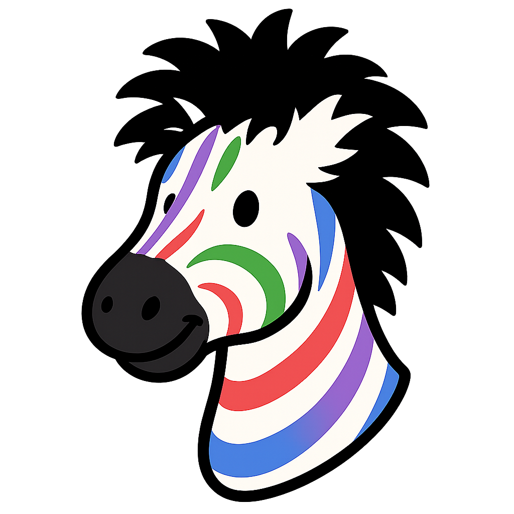

<p align="center">
    
</p>

# ZebraPuzzles.jl 🦓

[](https://kunzaatko.github.io/ZebraPuzzles.jl/stable/)
[](https://kunzaatko.github.io/ZebraPuzzles.jl/dev/)
[](https://github.com/kunzaatko/ZebraPuzzles.jl/actions/workflows/CI.yml?query=branch%3Atrunk)
[](https://coveralls.io/github/kunzaatko/ZebraPuzzles.jl?branch=trunk)
[](https://github.com/invenia/BlueStyle)
[](https://github.com/SciML/ColPrac)
[](https://github.com/JuliaTesting/Aqua.jl)

A Julia package for creating, solving, and analyzing [zebra puzzles](https://en.wikipedia.org/wiki/Zebra_Puzzle). Provides a framework for defining puzzles with attributes, adding clues, and finding unique solutions.

## Installation

```julia
using Pkg
Pkg.add("ZebraPuzzles")
```

## Quick Start

Define a classic zebra puzzle with attributes and clues:

```julia
using ZebraPuzzles

# Create a classic puzzle (Einstein's zebra)
puzzle = ZebraPuzzle(
  Drink => ("coffee", "milk", "orange juice", "tea", "water"),
  House => ("blue", "green", "ivory", "red", "yellow"),
  Nationality => ("Englishman", "Japanese", "Spaniard", "Ukrainian", "Norwegian"),
  Pet => ("dog", "horse", "snails", "zebra", "fox"),
  Smoke => ("Chesterfields", "Lucky Strike", "Old Gold", "Parliaments", "Kools"),
)

# Add clues
add_clues!(puzzle, [
  Clue(Nationality("Englishman"), House("red")),                  # The Englishman lives in the red house.
  Clue(Nationality("Spaniard"), Pet("dog")),                      # The Spaniard owns the dog.
  Clue(Drink("coffee"), House("green")),                          # Coffee is drunk in the green house.
  Clue(Nationality("Ukrainian"), Drink("tea")),                   # The Ukrainian drinks tea.
  ExactRelativePosition(House("green"), House("ivory"), 1),       # The green house is immediately to the right of the ivory house.
  Clue(Smoke("Old Gold"), Pet("snails")),                         # The Old Gold smoker owns snails.
  Clue(Smoke("Kools"), House("yellow")),                          # Kools are smoked in the yellow house.
  AbsolutePosition(Drink("milk"), 3, 5),                          # Milk is drunk in the middle house.
  AbsolutePosition(Nationality("Norwegian"), 1, 5),               # The Norwegian lives in the first house.
  AbsoluteDistance(Smoke("Chesterfields"), Pet("fox"), 1),        # The man who smokes Chesterfields lives in the house next to the man with the fox.
  AbsoluteDistance(Smoke("Kools"), Pet("horse"), 1),              # Kools are smoked in the house next to the house where the horse is kept.
  Clue(Smoke("Lucky Strike"), Drink("orange juice")),             # The Lucky Strike smoker drinks orange juice.
  Clue(Nationality("Japanese"), Smoke("Parliaments")),            # The Japanese smokes Parliaments.
  AbsoluteDistance(Nationality("Norwegian"), House("blue"), 1),   # The Norwegian lives next to the blue house.
])

# Solve the puzzle
solve!(puzzle)

# View the solution
show_solution(puzzle)
```

## Features

- **Random Generation**: Generate random puzzles of specified sizes
- **Solving Engine**: Use satisfiability solving to find solutions
- **Clue Validation**: Check that added clues do not violate minimality (i.e., are not implied by existing clues)
- **Natural Language Riddles**: Convert puzzles to human-readable descriptions

## Usage Examples

### Creating a Solved Puzzle

```julia
solved_puzzle = ZebraPuzzle(
    (House("yellow"), Nationality("Norwegian"), Drink("water"), Smoke("Kools"), Pet("fox")),
    (House("blue"), Nationality("Ukrainian"), Drink("tea"), Smoke("Chesterfields"), Pet("horse")),
    (House("red"), Nationality("Englishman"), Drink("milk"), Smoke("Old Gold"), Pet("snails")),
    (House("ivory"), Nationality("Spaniard"), Drink("orange juice"), Smoke("Lucky Strike"), Pet("dog")),
    (House("green"), Nationality("Japanese"), Drink("coffee"), Smoke("Parliaments"), Pet("zebra")),
)
```

### Adding Position-Based Clues

```julia
add_clue!(puzzle, AbsoluteDistance(Smoke("Chesterfields"), Pet("fox"), 1))
add_clue!(puzzle, ExactRelativePosition(House("green"), House("ivory"), 1))
```

### Generating Random Puzzles

```julia
using Random
Random.seed!(42)
random_puzzle = rand(UnsolvedZebraPuzzle{3,4})  # 4 subjects, 3 attributes each
```

### Converting to Natural Language

```julia
riddle(puzzle)  # Returns human-readable clue descriptions
```

## API Overview

- `ZebraPuzzle()`: Create puzzles from attributes or a truth table
- `add_clue!()`, `add_clues!()`: Add clues to puzzles
- `solve!()`: Find the unique solution
- `fill_clues!()`: Fill to a minimal set of random clues for solubility
- `riddle()`: Convert to natural language
- `show_solution()`: Display the solved truth table

See the [documentation](https://kunzaatko.github.io/ZebraPuzzles.jl/) for complete API reference and examples.

## Citing

See [`CITATION.bib`](CITATION.bib) for the relevant reference(s).
